<p align="center">
  
</p>

<h1 align="center">
  
</h1>

<p align="center">
  
  
  
</p>

<h3 align="center">Full Stack Web & App Developer • Business Solutions Specialist</h3>

<p align="center">
  <a href="https://shahinbhuiyan.vercel.app/">
    
  </a>
  <a href="mailto:shahinfiverr00@gmail.com">
    
  </a>
  <a href="https://wa.me/8801306897328">
    
  </a>
</p>


## 👨‍💻 About Me

> I'm a **passionate Full Stack Web & App Developer** from Bangladesh with **5+ years** of experience building modern, scalable and user-friendly digital solutions. I specialize in **business websites**, **custom web applications** and **e-commerce platforms** that help companies grow online.

```yaml
Name       : Shahin Bhuiyan
Role       : Full Stack Web & App Developer
Location   : Dhaka, Bangladesh 🇧🇩
Experience : 5+ Years
Freelance  : Available for new projects
WhatsApp   : +880 1306-897328
Focus      : Modern Websites • Web Apps • Business Solutions • REST APIs
```


## 🚀 What I Do

<p align="center">
  
</p>


## 🛠️ Tech Stack

### 👨‍💻 Languages
<p align="left">
  
  
  
  
  
  
  
  
  
  
</p>

### 🎨 Frontend
<p align="left">
  
  
  
  
  
  
</p>

### 🔧 Backend & Database
<p align="left">
  
  
  
  
  
  
  
  
</p>

### ⚙️ Tools & DevOps
<p align="left">
  
  
  
  
  
  
  
</p>


## 📊 GitHub Stats

<p align="center">
  
  
</p>

<p align="center">
  
</p>


## 🏆 Achievements

<p align="center">
  
</p>


## 💼 Let's Work Together

<p align="center">
  I'm currently <b>available for freelance projects</b> and <b>long-term collaborations</b>.<br>
  Whether you need a business website, custom web app, or full e-commerce platform — I can help bring your idea to life.
</p>

<p align="center">
  <a href="https://shahinbhuiyan.vercel.app/">
    
  </a>
  <a href="https://wa.me/8801306897328">
    
  </a>
</p>

<p align="center">
  <a href="mailto:shahinfiverr00@gmail.com">
    
  </a>
  <a href="https://twitter.com/imshahinbhuiyan">
    
  </a>
  <a href="https://fb.com/shahinbhuiyan0">
    
  </a>
  <a href="https://instagram.com/shahinbhuiyan0">
    
  </a>
</p>

## 🤝 Support My Work

<p align="center">
  If you like my work, consider giving a ⭐ to my repositories. It means a lot!
</p>

<p align="center">
  <i>Built with ❤️ by <a href="https://github.com/shahinbhuiyan"><b>Shahin Bhuiyan</b></a> — Let's build something great together!</i>
</p>


